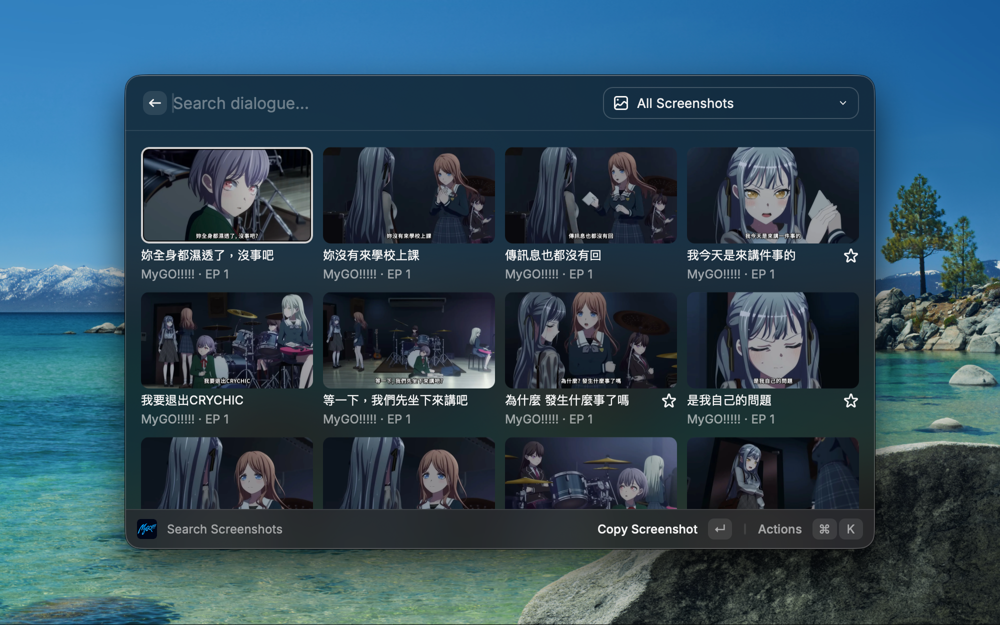
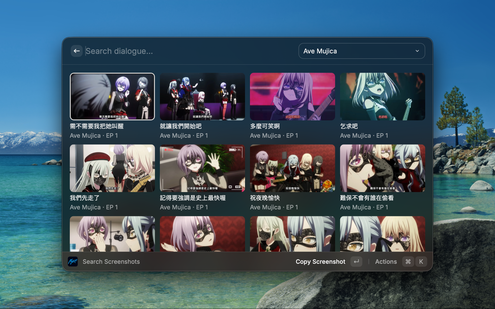
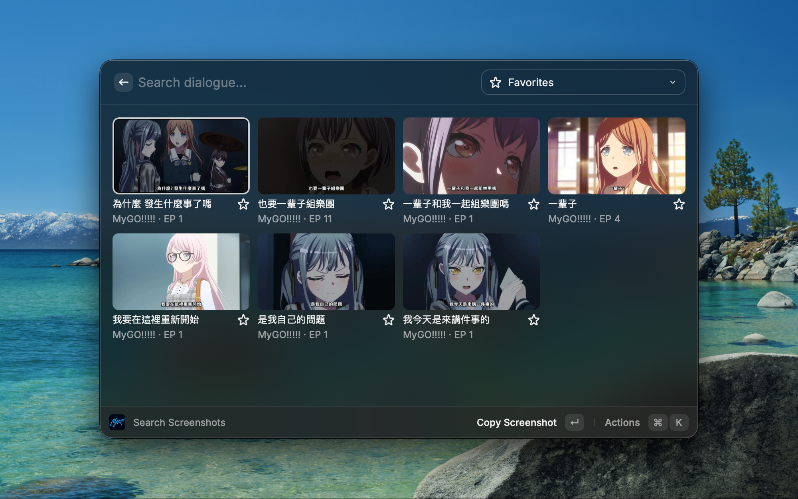
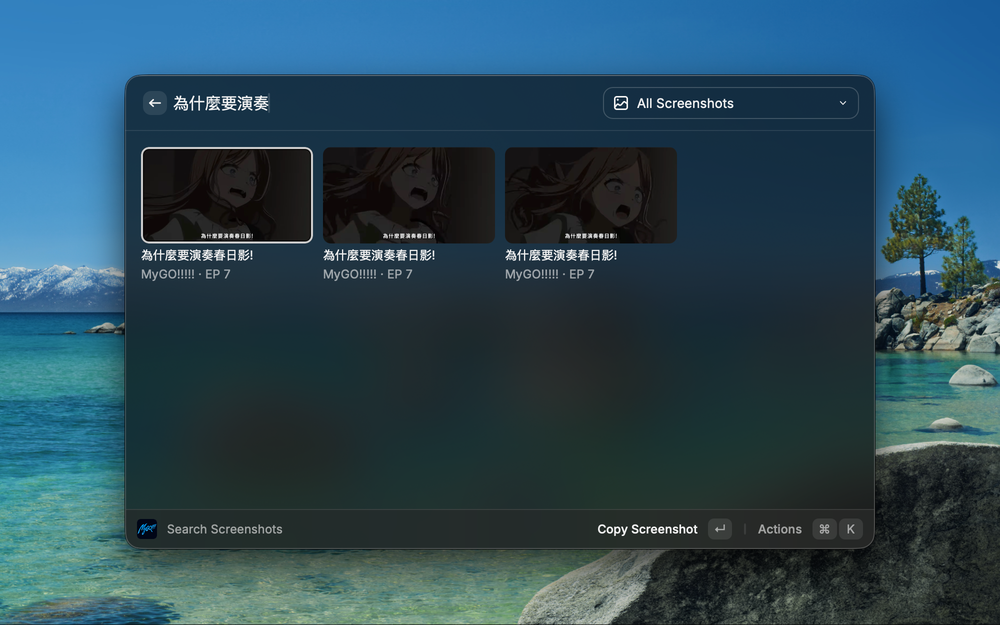

# BanG Dream! Screenshot Search

[English](README.md) | **繁體中文**

可以搜尋並快速複製 **MyGO!!!!!** 與 **Ave Mujica** 動畫繁體中文字幕截圖的 Raycast Extension。可以用台詞搜尋、切換系列、收藏常用圖片，並將選取的 JPG 直接複製到 macOS 剪貼簿。









### 需求

- macOS
- [Raycast](https://www.raycast.com/)
- [nvm](https://github.com/nvm-sh/nvm)
- Git

### 安裝
```bash
git clone https://github.com/LukeWei/BanG-Dream-Screenshot-Search.git
cd BanG-Dream-Screenshot-Search
nvm install
nvm use
npm install
npm run dev
```

專案的 `.nvmrc` 會指定使用 Node.js 22.22.2。執行 `npm run dev` 後，在 Raycast 搜尋 `Search Screenshots` 即可開啟。
之後 `npm run dev` 會持續執行，可以用 `Control-C` 停止。

## 使用方式

1. 開啟 Raycast，搜尋並執行 `Search Screenshots`。
2. 輸入中文台詞，或從右上角切換全部、系列、收藏與最近使用；也可按 `Command-1`、`Command-2`、`Command-3` 快速切換全部、收藏與最近使用。
3. 選取圖片後按 `Enter`，下載 JPG 並複製到剪貼簿。
4. 到 LINE、Discord、Teams 或其他 App 按 `Command-V` 貼上。

## 功能

- 支援繁體中文台詞、集數等等搜尋方式。
- 可依 MyGO!!!!!、Ave Mujica、收藏或最近使用篩選。
- 可用 `Command-1`、`Command-2`、`Command-3` 快速切換全部、收藏與最近使用。
- 最近使用最多保存 30 筆，重複使用的圖片會移到最前面。
- 圖片不會打包在 Extension 內，需要網路才能載入預覽與複製 JPG。

## 隱私與本機資料

- Raycast LocalStorage 只保存收藏與最近使用的截圖 ID。
- Extension 內只包含圖片 metadata 與固定到特定上游 commit 的遠端網址，不包含動畫圖片檔案。
- WebP 預覽與選取的 JPG 會直接從上游 GitHub repository 取得。
- 複製的圖片會暫存在 `/tmp/bang-dream-screenshot-search/`，並在後續成功複製時清除舊檔案。

## 圖片來源與權利聲明

截圖 metadata 與遠端圖片網址來自公開的 [Ave Mujica Screenshot Search repository](https://github.com/serser322/ave-mujica-images)，其網站為 [ave-mujica-images.pages.dev](https://ave-mujica-images.pages.dev/)。

《BanG Dream! It's MyGO!!!!!》與《BanG Dream! Ave Mujica》由木棉花代理，[《BanG Dream! It's MyGO!!!!!》YouTube 播放清單](https://www.youtube.com/playlist?list=PL12UaAf_xzfqYGkaq7fR0DpB6osiuNlYu) 與 [《BanG Dream! Ave Mujica》YouTube 播放清單](https://www.youtube.com/watch?list=PL12UaAf_xzfo6TAmxIM7rEvrJAB0rzAAO&v=dxmmSFQxWzM) 為圖片來源。

本 Extension 為非官方專案，與 BanG Dream! 的權利方及上游專案沒有隸屬或背書關係。

所有 BanG Dream! 相關名稱、商標、Logo、角色、動畫影像與截圖的著作權、商標權及其他相關權利，均歸各自的原始權利人所有。MIT License 僅適用於本 Extension 的原始碼，不授權任何名稱、Logo、角色、動畫影像或截圖。完整聲明請參閱 [NOTICE.md](NOTICE.md)。
